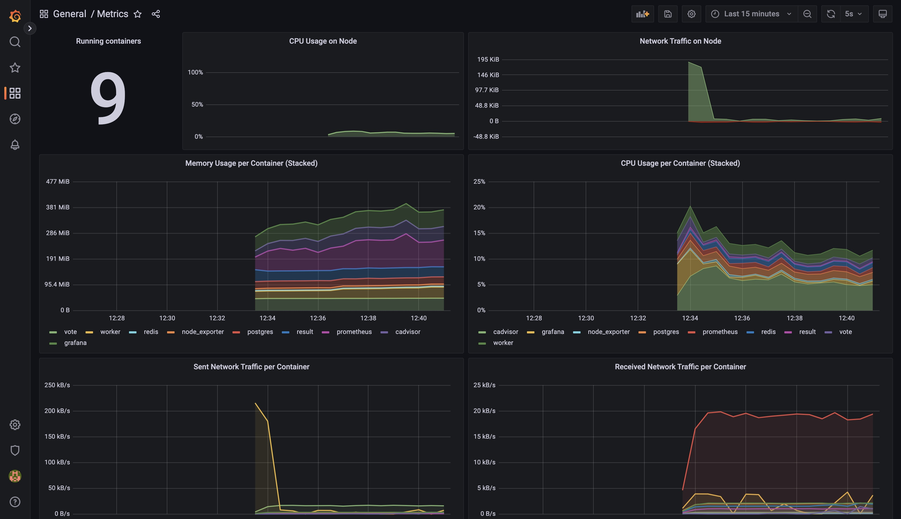

# App monitoring (Grafana + Kibana)

This repo contains a university project for a subject called Computer Systems Administration. The goal is to configure application monitoring using Grafana and Kibana, i.e. collect and monitor metrics, logs, configure alerts etc.

The application that was chosen to be monitored is an example voting app. The source can be found here:
https://github.com/dockersamples/example-voting-app

The intent of the project is to add monitoring services and configs around the given app without modifying the app itself.

## Getting started

Download [Docker Desktop](https://www.docker.com/products/docker-desktop) for Mac or Windows. [Docker Compose](https://docs.docker.com/compose) will be automatically installed. On Linux, make sure you have the latest version of [Compose](https://docs.docker.com/compose/install/).

Run in this directory to build and run the app:

```shell
docker compose up
```

To also run the monitoring services use profile:

```shell
docker compose --profile monitoring up
```

The `vote` app will be running at [http://localhost:10100](http://localhost:10100), and the `results` will be at [http://localhost:10101](http://localhost:10101).


## Metrics

Grafana will be running at [http://localhost:10110](http://localhost:10110) (unless run without specifying the compose profile).
Prometheus datasource and metrics dashboard are imported on startup.

This is an example of what the dashboard should look like:


